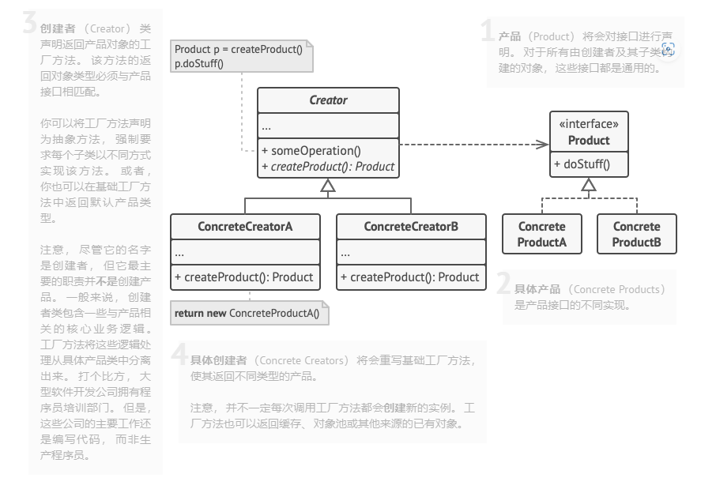
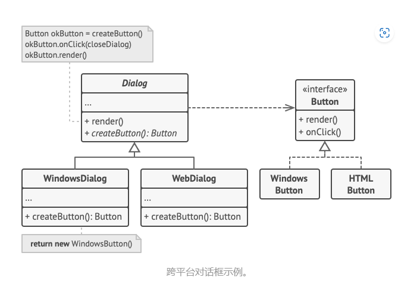

# 工厂方法模式

使用**工厂方法**替代对象构造函数的直接调用（即使用 `new` 运算符）。并不是不使用 `new` 运算符，而是将该运算符移动到**工厂方法**中进行调用，使用工厂方法创建的对象通常被称作为 "**产品**"

意义：可以继承**工厂**，重写**工厂方法**，从而改变创建的 **产品**
角色：创建者(工厂)，产品，具体创建者（具体工厂），具体产品

举例：使用 **工厂方法** 开发跨平台 UI 组件，可以避免客户代码与具体的 UI 类之间的耦合。比如创建 `Button`，由于是跨平台 UI，既有 `windowButton`，又有 `webButton`，如果直接在代码中写具体的 `windowButton` 或者 `webButton`，那么就缺少灵活性，代码变得耦合。根据 **依赖倒置原则**，高层模块不能依赖于低层模块，他们都应该依赖于抽象。

### 使用场景：

1. 无法预知产品的确切类型及其依赖关系的时候

   > 工厂方法将创建产品的代码与实际使用产品的代码进行分离，从而能够在不影响其他代码的情况下，扩展创建产品的代码。

2. 希望别人能够扩展你的软件库或者内部组件的时候

3. 希望复用对象来节省系统资源，而不是每次都重新创建对象，可以使用工厂方法
   > 工厂方法的特点是： 创建产品的代码与使用产品的代码分离，利用这个特点，可以在创建产品的时候进行逻辑处理，复用已存在的对象。

### 实现方式

1. 让所有的产品都遵循同一个接口。

2. 在创建类中添加一个空的工厂方法。该方法的返回类型必须遵循通用的产品接口。

3. 将使用构造函数创建产品的代码，替换为使用工厂方法创建产品，同时将构造函数创建产品的代码移入工厂方法中。
   > 可能需要在工厂方法中添加参数，来决定最终返回的产品具体类型。这会导致工厂方法的代码出现**条件分支**进行判断，看起来及其的丑陋。

4. 为工厂方法中的每一个产品编写一个创建子类，然后再子类中重写工厂方法。

5. 如果应用中的产品类型太多，不必为每一个产品编写创建子类，可以在子类中复用基类的控制参数。

6. 代码经过上述移动后，基础工厂方法中已没有任何代码，可以将该类变为抽象类。如果基础工厂方法中还有其他语句，可以将其设置为该方法的默认行为。